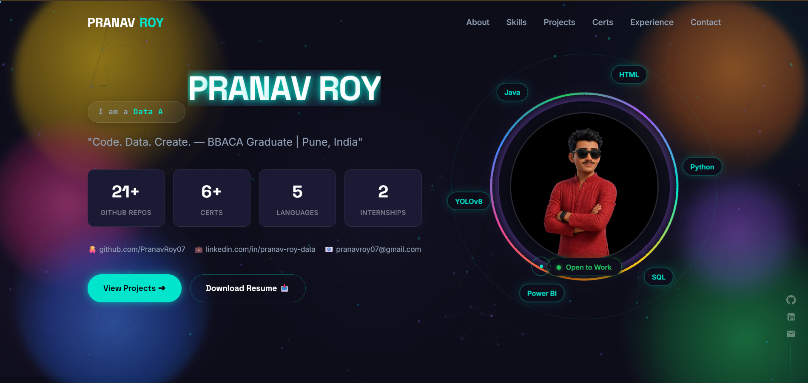

# 🚀 Pranav Roy — Personal Portfolio Website

<div align="center">



[](https://pranavroy07.github.io)
[](https://github.com/PranavRoy07)
[](https://linkedin.com/in/pranav-roy-data)
[](mailto:pranavroy07@gmail.com)

**BBACA Graduate · Software Engineer · Data Analyst · AI Builder**
*Pune, India · Open to Entry-Level Roles*

</div>

---


## 📌 About This Portfolio

This is my personal portfolio website built to showcase my projects, skills, internships, and certifications. The portfolio features a cinematic dark theme, multicolor animated background, sticky-scroll project cards, and a fully responsive layout.

> *"Code. Data. Create. — BBACA Graduate | Pune, India"*

---

## ✨ Features

- **Cinematic Preloader** — 5-phase branded loading sequence
- **Sticky Scroll Project Stack** — 15 project cards that overlap each other as you scroll (like a card deck)
- **Multicolor Bouncing Background** — 6 animated balls in yellow, orange, pink, blue, green, purple
- **Magnetic Custom Cursor** — dot + lagging ring with color-change on hover
- **Particle Canvas** — tsParticles constellation with mouse repulsion
- **Typed.js Hero** — role subtitle cycles through 5 roles
- **CountUp Stats** — animated number counters in hero section
- **Rainbow Avatar Ring** — conic-gradient rotating multicolor ring
- **Orbiting Tech Badges** — 6 language badges orbit the PR monogram
- **GSAP ScrollTrigger** — clip-path wipe reveals on all section titles
- **VanillaTilt 3D Cards** — engineering project cards tilt on mouse movement
- **Neon Text Effects** — hero name backlight flash + flicker + shimmer sweep + glitch on hover
- **Live Terminal** — contact section types out a full bash session
- **Closing Statement** — "Still Building. Still Learning." with gradient animation
- **Scroll Progress Bar** — thin cyan line fills as you read down
- **Floating Social Sidebar** — fixed right-side GitHub/LinkedIn/Email icons
- **Fully Responsive** — mobile-first, works on all screen sizes

---

## 🛠️ Tech Stack

| Category | Technologies |
|---|---|
| **Structure** | HTML5, CSS3, Vanilla JavaScript |
| **Animations** | GSAP + ScrollTrigger, AOS (Animate on Scroll) |
| **Effects** | tsParticles, Typed.js, CountUp.js, VanillaTilt |
| **Fonts** | Space Grotesk, Inter |
| **Deployment** | GitHub Pages |
| **Version Control** | Git, GitHub |

---

## 📁 Project Structure

```
pranavroy07.github.io/
│
├── index.html                  # Main portfolio file
│
├── assets/
│   ├── screenshots/            # Project dashboard screenshots
│   │   ├── zepto_War_Room.png
│   │   ├── cinema_dashboard.png
│   │   ├── bank_churn_dashboard.png
│   │   ├── growth_experimentation.png
│   │   ├── ipl_team_wins.png
│   │   ├── jobs_Indian_Market.png
│   │   ├── ibm_dashboard.png
│   │   ├── codealpha_DA.png
│   │   ├── codealpha_AI.png
│   │   ├── vanilla_quiz.png
│   │   ├── cinema_site.png
│   │   ├── realtime_noteboard.png
│   │   ├── job_intelligence.png
│   │   ├── freecodecamp.png
│   │   └── s2c_addport.png
│   │
│   ├── certificates/           # Certification images
│   │   ├── cert_freecodecamp.png
│   │   ├── cert_sql.png
│   │   ├── cert_tata.png
│   │   ├── cert_deloitte.png
│   │   ├── cert_aws.png
│   │   └── cert_codealpha.png
│   │
│   └── avatar.jpg              # Profile photo
│
└── resume.pdf                  # Downloadable resume
```

---

## 🗂️ Portfolio Sections

| # | Section | Description |
|---|---|---|
| 1 | **Hero** | Name, typed role subtitle, stat counters, avatar with rainbow ring, orbiting tech badges |
| 2 | **About** | Bio, quick stats, identity cards |
| 3 | **Skills** | Language progress bars, Data & AI tags, Dev Tools grid |
| 4 | **Projects** | 15 sticky-scroll overlap cards (see full list below) |
| 5 | **Engineering** | 6 core engineering builds (Java, C, C++, Python) |
| 6 | **Certifications** | Text-row layout with platform badges |
| 7 | **Experience** | 2× CodeAlpha internship cards (Data Analytics + AI) |
| 8 | **Education** | BBACA degree + self-learning certifications |
| 9 | **Closing** | "Still Building. Still Learning." statement |
| 10 | **Contact** | Live terminal + social links + resume download |

---

## 📊 Featured Projects (15 Sticky Stack Cards)

| # | Project | Domain | Tech | Live |
|---|---|---|---|---|
| 01 | [Zepto vs Blinkit War Room](https://github.com/PranavRoy07/ZEPTO-VS-BLINKIT-WAR-ROOM) | Data Analytics | SQL, Python, Power BI, ARIMA | — |
| 02 | [Pan-India Cinema Intelligence](https://github.com/PranavRoy07/Pan-India-Cinema-Dashboard) | Data Analytics | Power BI, DAX, Excel | — |
| 03 | [CodeAlpha AI Builds](https://github.com/PranavRoy07/CodeAlpha_AI) | AI / ML | Python, YOLOv8, TF-IDF, Claude API | — |
| 04 | [Script2Cinema](https://github.com/PranavRoy07/script2cinema) | Web | HTML, CSS, JS, Firebase | [🚀 Live](https://pranavroy07.github.io/script2cinema/) |
| 05 | [Job Intelligence Engine](https://github.com/PranavRoy07/job-tracker) | Python | Rich, SQLite, APScheduler | — |
| 06 | [CodeAlpha Data Analytics](https://github.com/PranavRoy07/CodeAlpha_DataAnalytics) | Data Analytics | Python, BeautifulSoup, TextBlob | — |
| 07 | [IPL Match Performance Analyzer](https://github.com/PranavRoy07/IPL-Match-Performance-Analyzer) | Data Analytics | PostgreSQL, Python, Seaborn | — |
| 08 | [Global DS Job Market Analysis](https://github.com/PranavRoy07/Global-Data-Science-Job-Market-Analysis) | Data Analytics | PostgreSQL, SQL, CTEs | — |
| 09 | [IBM HR Attrition Dashboard](https://github.com/PranavRoy07/IBM-HR-Employee-Attrition-Dashboard) | Data Analytics | Excel, Pivot Tables | — |
| 10 | [Bank Customer Churn Analytics](https://github.com/PranavRoy07/Bank-Customer-Churn-Analytics) | ML + Analytics | Python, scikit-learn, Streamlit | [🚀 Live](https://bank-customer-churn-risk.streamlit.app/) |
| 11 | [Growth Experimentation Analytics](https://github.com/PranavRoy07/Growth-Experimentation-Retention-Analytics) | Analytics | Python, A/B Testing, Streamlit | [🚀 Live](https://growth-experimentation-retention-analytics-09.streamlit.app/) |
| 12 | [Vanilla JS Quiz Engine](https://github.com/PranavRoy07/vanilla-js-quiz-engine) | Web | JavaScript, DOM API, localStorage | — |
| 13 | [Pan-India Cinema Site](https://github.com/PranavRoy07/pan-india-cinema-dashboard-site) | Web | JS, Fetch API, Promise.allSettled | — |
| 14 | [Realtime Collaborative Note Board](https://github.com/PranavRoy07/Realtime-Collaborative-Note-Board-) | Web | JS, Node.js, WebSocket | — |
| 15 | [freeCodeCamp Data Analysis](https://github.com/PranavRoy07/FreeCodeCamp) | Data Analytics | Python, Pandas, Matplotlib, SciPy | — |

---

## ⚙️ Core Engineering Builds

| Project | Language | Highlights |
|---|---|---|
| [Library Management System](https://github.com/PranavRoy07/library-management-system) | Java | 17/17 JUnit 5 tests, all 5 GoF design patterns |
| [DSA Tracker](https://github.com/PranavRoy07/dsa-tracker) | Java | 30 problems, brute + optimised, JUnit 5 |
| [Dynamic Array in C](https://github.com/PranavRoy07/DynamicArray-C) | C | malloc/realloc, Valgrind zero-leak |
| [Doubly Linked List & BST](https://github.com/PranavRoy07/DoublyLinkedList-BST-C) | C | All 3 BST deletion cases, Valgrind clean |
| [Python Algorithm Library](https://github.com/PranavRoy07/Python-Algorithm-Library) | Python | 25 problems, pytest, type hints, Google docstrings |
| [Banking System C++](https://github.com/PranavRoy07/Banking-System-CPP) | C++ | RAII, templates, Rule of Five, Valgrind clean |

---

## 🎓 Certifications

| Certification | Issuer |
|---|---|
| Data Analysis with Python | freeCodeCamp |
| SQL for Data Science | Simplilearn + Oracle Dev Gym |
| Python, Pandas, ML Courses | Kaggle |
| Tata iQ Data Analytics Simulation | Forage |
| Deloitte Data Analytics Simulation | Forage |
| AWS Cloud Practitioner Simulation | Forage |
| Data Analytics + AI Internship | CodeAlpha |

---

## 💼 Experience

**CodeAlpha — Data Analytics Intern** *(2025)*
- Web scraping with BeautifulSoup, EDA with Pandas, NLP sentiment analysis on IMDB 50K reviews
- Built: CodeAlpha Data Analytics project

**CodeAlpha — AI Intern** *(2025)*
- Built ARIA (TF-IDF + Claude API chatbot), TITAN (YOLOv8 + ByteTrack detection), Language Translator
- Delivered full documentation: internship log sheets, GR forms, project reports

---

## 🚀 Running Locally

Since this is plain HTML — no build step needed:

```bash
# Clone the repo
git clone https://github.com/PranavRoy07/pranavroy07.github.io.git

# Open in browser
cd pranavroy07.github.io
open index.html       # Mac
start index.html      # Windows
xdg-open index.html   # Linux
```

Or use VS Code Live Server extension for hot reload.

---

## 📤 Deployment

Deployed via **GitHub Pages** — automatic on every push to `main`.

```bash
# To update the live site
git add .
git commit -m "update: <what you changed>"
git push
# Live at pranavroy07.github.io within 1-2 minutes
```

---

## 📬 Contact

| Platform | Link |
|---|---|
| 🌐 Portfolio | [pranavroy07.github.io](https://pranavroy07.github.io) |
| 💼 LinkedIn | [linkedin.com/in/pranav-roy-data](https://linkedin.com/in/pranav-roy-data) |
| 🐙 GitHub | [github.com/PranavRoy07](https://github.com/PranavRoy07) |
| 📧 Email | [pranavroy07@gmail.com](mailto:pranavroy07@gmail.com) |

---

## 📄 License

This portfolio is open source for reference and inspiration.
Please do not copy content, project descriptions, or designs directly.

---

<div align="center">

**Built by Pranav Roy · Pune, Maharashtra, India · 2026**
*Open to Entry-Level SWE · Data Analyst · Banking Roles — Pune & Remote*

⭐ If you found this helpful, consider starring the repo!

</div>
